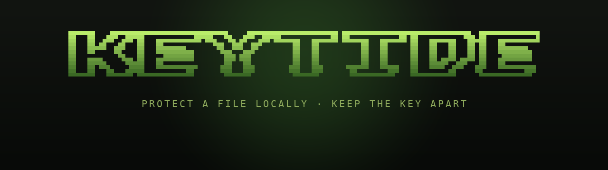

# KeyTide

<p align="center">
  
</p>

<p align="center">
  <a href="https://remypicciano.github.io/keytide/">Project site</a> ·
  <a href="https://github.com/remypicciano/keytide/releases">Releases</a> ·
  <a href="docs/coffer-format-v1.md">Format specification</a> ·
  <a href="docs/threat-model.md">Threat model</a>
</p>

<p align="center">
  <a href="https://github.com/remypicciano/keytide/releases"></a>
  <a href="LICENSE"></a>
  <a href="https://github.com/remypicciano/keytide/releases"></a>
  <a href="docs/coffer-format-v1.md"></a>
</p>

KeyTide is a local-first desktop application for protecting individual files with authenticated encryption and a separate unlock key. Protection and restoration run entirely on-device. There is no account, cloud sync, or recovery backdoor.

Version 1.0.0 is the first stable release. Download release archives from [GitHub Releases](https://github.com/remypicciano/keytide/releases) and verify the included SHA-256 checksum before use. The public project site at [https://remypicciano.github.io/keytide/](https://remypicciano.github.io/keytide/) documents the security model, platform builds, and format roadmap.

## What it produces

```text
source file
  → protected container  (.coffer)
  → separate unlock key  (.cofferkey)
```

KeyTide keeps the original file untouched, writes a new encrypted container, and writes a matching key file beside it. The two outputs are meant to be stored separately; both are required to restore the file.

## Highlights

- Protects one local file at a time.
- Keeps the original file unchanged.
- Creates a fresh key for every protection run.
- Authenticates before restoring plaintext.
- Refuses overwrite races and unsafe output names.
- Keeps all protection and restoration work local to the machine.

## Quick start

### 1. Run the app

```sh
cargo run
```

### 2. Protect a file

1. Choose a source file.
2. Choose a destination for the protected container.
3. Save the generated key in a different place.

### 3. Restore later

1. Choose the `.coffer` container.
2. Choose the matching key file.
3. Pick a new destination for the restored file.

Run `cargo run -- --help` or inspect the UI for the available flows and safety checks.

## Desktop workflow

1. Open the app and pick either Protect or Restore.
2. Review the selected file, output name, and destination.
3. Confirm the operation only after verifying the container and key are being written separately.
4. Move the key away from the container after saving.

## How it works

1. The app reads the selected file locally.
2. It generates a fresh random AES-256-GCM key for the protected output.
3. The file bytes and filename metadata are encrypted into a versioned container.
4. The matching key is written as a separate file.
5. Restoration verifies authentication before writing plaintext.

## Development

Install Rust with edition 2024 support and the platform dependencies required by `eframe` and `rfd`.

Run these checks before opening a change:

```sh
cargo fmt --all -- --check
cargo test --locked
cargo clippy --locked --all-targets --all-features -- -D warnings
cargo audit
python3 tools/check_docs.py
python3 tools/check_site.py
python3 -m py_compile tools/*.py
```

## Project structure

```text
src/              Rust application and UI code
docs/             Format, security, and development notes
site/             GitHub Pages site
tools/            Recovery and validation helpers
```

## Documentation

- [Format specification (v1)](docs/coffer-format-v1.md) — frozen byte layout and deterministic compatibility vector
- [Format draft (v2)](docs/coffer-format-v2.md) — key carriers and metadata sanitization
- [Threat model](docs/threat-model.md) — assumptions, out-of-scope threats, residual risks
- [Recovery guide](docs/recovery.md) — cross-platform decryption and the standalone recovery tool
- [Feature catalog](docs/features.md) — implemented and planned behavior
- [Security policy](SECURITY.md)

## About

Created by [Rémy Picciano](https://github.com/remypicciano). KeyTide reflects a preference for local workflows, clear security boundaries, and software that stays explainable.

## Contact

- Email: [remypicciano@icloud.com](mailto:remypicciano@icloud.com)
- GitHub: [github.com/remypicciano](https://github.com/remypicciano)
- Project discussions: [open a GitHub issue](https://github.com/remypicciano/keytide/issues)
- Security issues: use [private vulnerability reporting](https://github.com/remypicciano/keytide/security/advisories/new)

## License

KeyTide is available under the [MIT License](LICENSE).

Never attach real keys, private containers, or confidential plaintext to an issue or support request.
